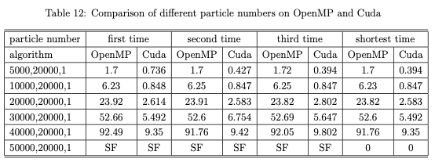
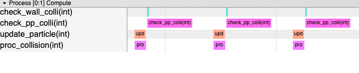

# Particle Collision Simulation

Particle Collision Simulation with OpenMP and CUDA

A [report](report.pdf) file can also be seen.


## File List

* `collision_seq.c`: sequential implementation
* `collision_seq_p*.c`: different parallelized sequential implementation mentioned in report
* `collision_grid.c`: grid implementation 
* `collision_grid_p.c`: parallelized grid implementation 
* `collision_cuda_basic.cu`: basic version of CUDA 
* `collision_cuda_balance.cu`: balanced version of CUDA

## Format

### Input

Input file strictly follows the structure shown below: 

1. N – Number of particles on the square surface  
2. L – Size of the square (in μm)  
3. r – Radius of the particle (in μm)  
4. S – Number of steps (timeunits) to run the simulation for  
5. print or perf– If word print appears, the position of each particle needs to be printed at each step.  Otherwise perf should appear.  
6. Optional: For each particle, show on one line the following information, separated by space: 
   * i–the index of the particle from 0 to N−1
   * x – intial position of particle index i on x axis (in μm)
   * y – intial position of particle index i on y axis (in μm)
   * vx – initial velocity on the x axis of particle i (in μm/timeunit) 
   * vy – initial velocity on the y axis of particle i (in μm/timeunit) 

If the initial location of the particles is not provided, program will generate random positions and velocities for all particles. The positions should be values within the 2D surface L × L, while velocities should be in the interval L/r and L/8r . 

### Sample Input

```
1000 20000 1 1000 print
```

### Output

Output file strictly follows the structure shown below: 

1. Print the positions and velocities of each particle in the beginning of the simulation. For each particle, show on one line the following information, separated by space: 
   * 0 – step 0 in the simulation
   * i – the index of the particle
   * x – initial position of particle index i on x axis (in μm)
   * y – initial position of particle index i on y axis (in μm)
   * vx – initial velocity on the x axis of particle i (in μm/timeunit) • vy – initial velocity on the y axis of particle i (in μm/timeunit) 
   
2. If print is used in the input file, at each step (time unit) tu, your program should output the positions and velocities of each particle. The print should be done after the particle movement is computed for that step. For each particle, show on one line the following information, separated by space: 
   * tu – the step in the simulation
   * i – the index of the particle
   * x – position of particle index i on x axis (in μm) at time tu
   * y – position of particle index i on y axis (in μm) at time tu
   * vx – velocity on the x axis of particle i (in μm/timeunit) at time tu 
   * vy – velocity on the y axis of particle i (in μm/timeunit) at time tu 
   
3. At the end of the simulation, for each particle show on one line the following information, separated by space: 
   * S – last step in the simulation
   * i – the index of the particle
   * x – final position of particle index i on x axis (in μm)
   * y – final position of particle index i on y axis (in μm)
   * vx – final velocity on the x axis of particle i (in μm/timeunit) 
   * vy – final velocity on the y axis of particle i (in μm/timeunit) 
   * pcollisions – total number of collisions with other particles
   * wcollisions – total number of collisions with the wall 
   

To avoid the errors associated with the floating pointing computations, we use double precision floating point operations (double) for x, y, vx, vy. 

### Physics Engine

You can them in [report](report.pdf) file.

## How to run

* for non-CUDA codes, eg:

  ```bash
  ./run_omp inputs.txt collision_seq
  ```

* for CUDA codes, eg:

  ```bash
  ./run_cuda inputs.txt collision_cuda_basic [num block] [num thread]
  ```

* to draw demo fig:

  ```bash
  python draw.py --inputs_file inputs.txt --outputs_file outputs.txt
  ```

## Results to show

### Performance



### CUDA Visualization



simple nvvp ref https://github.com/ezyang/nvprof2json

