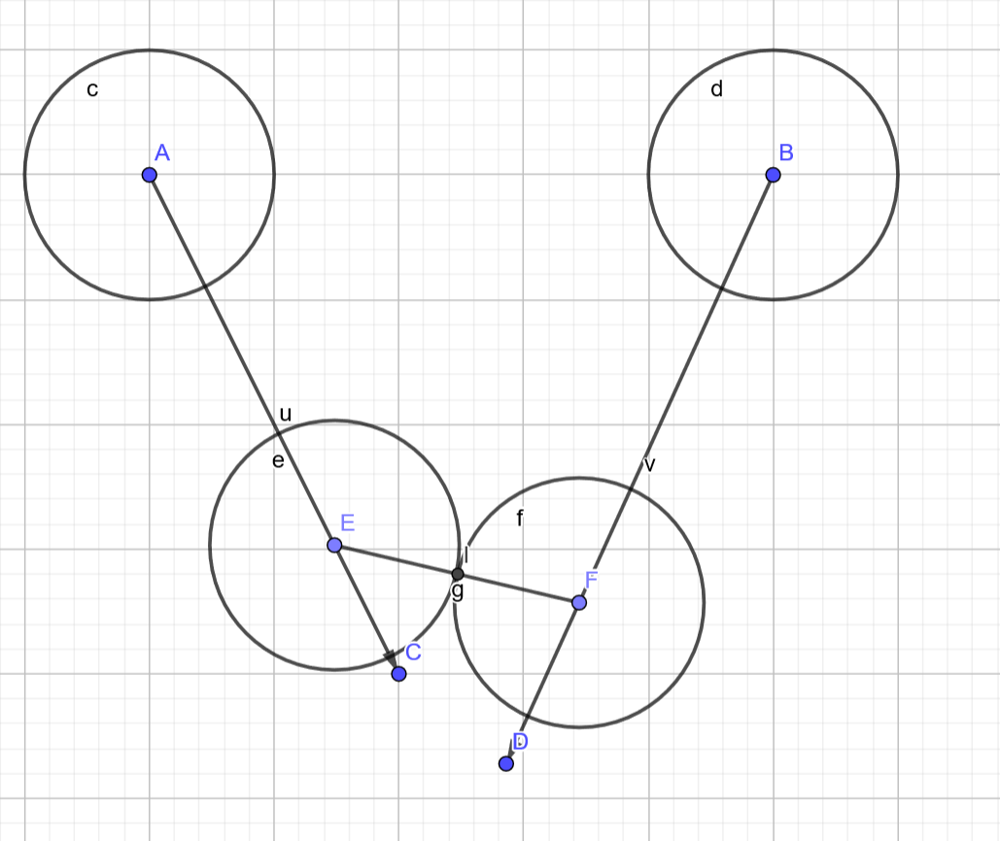

https://www.soinside.com/question/FXNseYqxjkZhbrYKHisAgM

To compile code: 
```
gcc -fopenmp -o collision collision.c -lm
```

Formulas can be seen in [MS whiteboard](https://wbd.ms/share/v2/aHR0cHM6Ly93aGl0ZWJvYXJkLm1pY3Jvc29mdC5jb20vYXBpL3YxLjAvd2hpdGVib2FyZHMvcmVkZWVtLzhkMTA5YWQwZGRjMDQxZGZhZjA4MjhlNDY3ZTI3NzRhX0JCQTcxNzYyLTEyRTAtNDJFMS1CMzI0LTVCMTMxRjQyNEUzRA==)

(Tip: use [MathJax Plugin](https://chrome.google.com/webstore/detail/mathjax-plugin-for-github/ioemnmodlmafdkllaclgeombjnmnbima) with Chrome to render tex math expression)

**Q1**. Given 2 moving particles of size $r$, with $\vec{v_1},\vec{v_2}$, when collision happens?



$\iff$

$\vec{AE}=\lambda\vec{AC},\quad\vec{BF}=\lambda\vec{BD},\quad||\vec{EF}||=2r$

$A(x_1,y_1), C(x_1',y_1'), B(x_2,y_2), D(x_2',y_2')$  $\Rightarrow$

$\vec{EF} = -\vec{AE}+\vec{AB}+\vec{BF}$

$\vec{EF} = \left(\lambda(x_2'-x_1'+x_1-x_2)+x_2-x_1,\lambda(y_2'-y_1'+y_1-y_2)+y_2-y_1\right)$

given $||\vec{EF}||^2=4r^2$, set $\Delta_x=x_2-x_1$ ....; $D_x = \Delta_x'-\Delta_x$ ...

$\Rightarrow$

$\lambda^2(D_x^2+D_y^2)+2\lambda(\Delta_xD_x+\Delta_yD_y)+\Delta_x^2+\Delta_y^2-4r^2=0$

$\Rightarrow$

$\lambda = $ blabla...


For parallelism,  for the same sequential code, we can try to parallel it in different ways. 

For p1.c, p2.c and p3.c, the difference is around line 160. p1.c only parallelizes the outer i loop, p2.c just parallelizes the inner j loop while p3.c parallelizes them both.

Under the case where schedule are all static, p2 performs best around 8s (based on inputs.txt). p1 follows with around 30s and p3 performs worst like 200+ secs.

For p1d.c, I change the schedule in two of the parallelism into dynamic(line 160 and 300). This improves the performance of p1, into like 20s. 

But the same improvement does not work for the inner loop. It turns the performance into 90s.

Overall, the best one is p2.c (inner j loop with static schedule).

### Issues:

1. 初始化的时候，不用做并行啦，这个不是关注点

2. clock() 的位置，从step0 开始，init不考虑了

## Algorithm Improvements:

benchmark: 

```
4000 200 1 100 perf
```

| Naive ver. | Relative |
| ---------- | -------- |
| 3.65       | 3.30     |

## Grid

每个点的轨迹 -> bounding box 

不断细化：
    1. 完全在block中的particle
    2. 部分在block中的particle
只与同级或次级的block比较

Idea：

-----------------------

## Update:

1. line155-175: 减法顺序有问题，已修改
2. line203-236: 参考[blog](https://www.gamasutra.com/view/feature/131424/pool_hall_lessons_fast_accurate_.php?page=2), 改进碰撞检测


## Update oct 17:

1. 考虑overlap， 
2. 撞墙优先级更高

